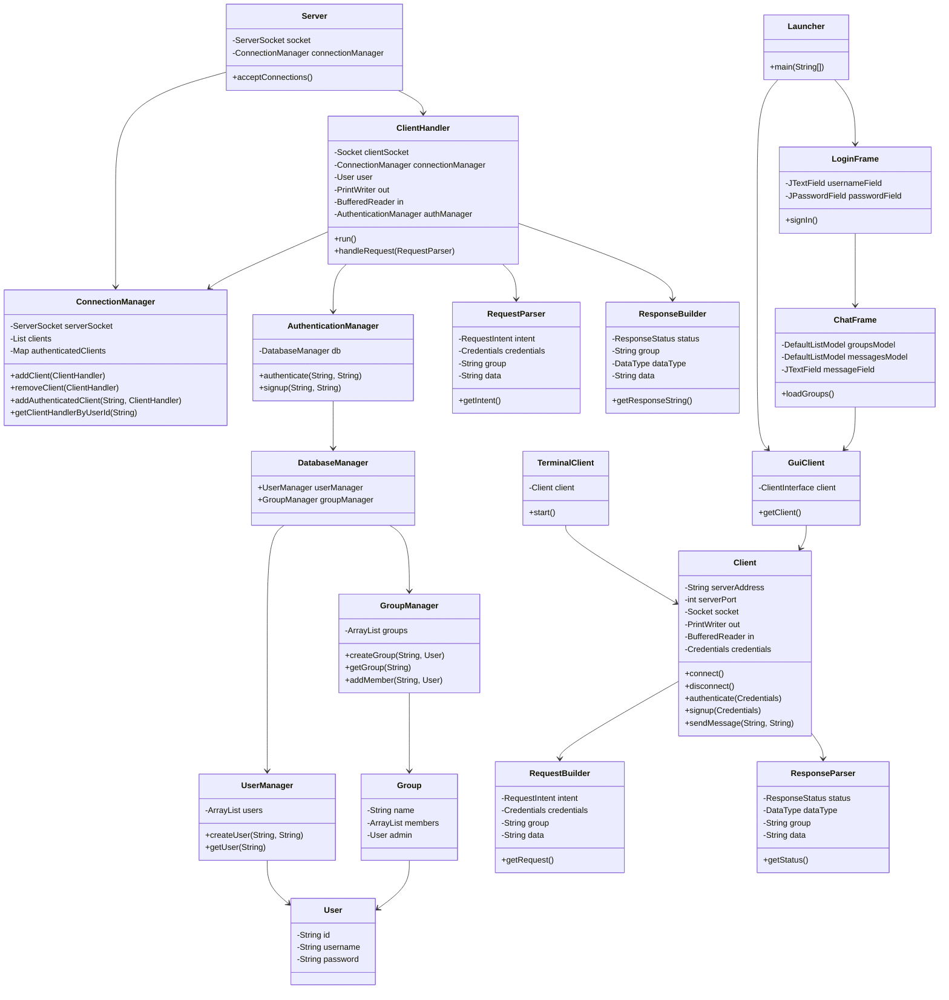

# Rasel ( راسل )
Rasel is a clinet-server real-time chat application built on top of **rasel** protocol, 
which is a custom, TCP-based protocol for real-time communication, this repo contains
both server and client implementations as well as a dedicated Terminal Based client
and a GUI client built with Swing.

## Motivation
Why should I spend months learning complex frameworks and protocols to build a simple real-time chat application?

I was trying to build a simple chat application and I found that I have to learn **Enterprise** level frameworks and protocols like **WebSocket**, just to build my simple chat app?

That seemed like using a sword to cut a paper!

So I decided to build my own real-time TCP-based protocol and a simple chat application on top of it.

## Running Applications

> [!IMPORTANT]
> This project uses Java 21 and Maven as build tool and dependency manager, make sure to have maven installed on your system, if it is not yet installed, you can follow the officila instructions [here](https://maven.apache.org/install.html).

This project hosts three main applications: 
1.  **Server**: The server application that handles client connections, authentication, and message routing.
2.  **Terminal Client**: A command-line interface for users to interact with the chat server.
3.  **GUI Client**: A graphical user interface built with Swing for a more user-friendly experience.

to run any of these applications, first you need to clone the repository: 

```bash
git clone https://github.com/ahmedshayea/Rasel.git
cd Rasel 
```

Then you can build the desired application using Maven, each application has its own Maven profile, available profiles are: `server`, `gui`, `terminal`

To build the server application, run:

```bash
mvn package -P server
```
This will generate a fat JAR file located at `target/rasel-server.jar` 

use the following command to run the jar file: 

```bash
java -jar target/rasel-server.jar
```

Other applications can be build the same way, just replace the profile name with the desired one: 

```bash
mvn package -P gui # for GUI client
mvn package -P terminal # for Terminal client 
```

To run the GUI client, use:

```bash
java -jar target/rasel-gui.jar
```
To run the Terminal client, use:

```bash
java -jar target/rasel-terminal.jar
```

> [!IMPORTANT]
> Make sure the server is running before starting any client application, gui client and terminal client will fail to start if the server is not running.

## Features
- **Client-Server Architecture**: A robust server that can handle multiple concurrent clients.
- **Custom Protocol**: A simple, text-based protocol for client-server communication.
- **Authentication**: Secure user authentication and signup.
- **Group Chat**: Users can create, join, and send messages to groups.
- **Multiple Clients**:
    - **Terminal Client**: A command-line interface for interacting with the chat server.
    - **GUI Client**: A user-friendly graphical interface built with Swing.
- **In-Memory Data Store**: The server uses an in-memory data store for users and groups, with a database-ready architecture.

## Class Diagram

The following diagram illustrates the high-level architecture of the Jrasel project:



## Project Structure

The project is organized into the following main packages:

-   `com.rasel.server`: Contains the server-side logic, including connection management, authentication, and request handling.
-   `com.rasel.client`: Contains the client-side logic, including the base `Client` class and the `TerminalClient`.
-   `com.rasel.gui`: Contains the Swing-based GUI client, including the `Launcher`, `LoginFrame`, and `ChatFrame`.
-   `com.rasel.common`: Contains classes shared between the client and server, such as the `Request` and `Response` builders and parsers.
-   `com.rasel.server.db`: Contains the in-memory database implementation for managing users and groups.

## How It Works

### Server

1.  The `Server` class initializes a `ServerSocket` and listens for incoming client connections.
2.  For each new connection, a `ClientHandler` thread is created to handle communication with that client.
3.  The `ClientHandler` reads requests from the client, parses them using `RequestParser`, and processes them based on the `RequestIntent`.
4.  The `AuthenticationManager` handles user authentication and signup, interacting with the `DatabaseManager`.
5.  The `ConnectionManager` keeps track of all connected clients and their authentication status.
6.  The `DatabaseManager`, along with `UserManager` and `GroupManager`, manages the application's data in memory.

### Client

1.  The `Client` class establishes a connection to the server and provides methods for sending requests and receiving responses.
2.  The `TerminalClient` provides a command-line interface for users to interact with the chat service.
3.  The `GuiClient` and the other classes in the `com.rasel.gui` package provide a graphical user interface for a more user-friendly experience.
4.  Both clients use the `RequestBuilder` to construct requests and the `ResponseParser` to interpret responses from the server.

## Protocol

The communication between the client and server is based on a custom, text-based protocol. Requests and responses are formatted as a series of key-value pairs, terminated by a special end-of-message marker.

### Request Format

```
INTENT:<intent>
CREDENTIALS:<username>:<password>
GROUP:<group_name>
DATA:<message>
END_OF_REQUEST
```

### Response Format

```
STATUS:<status>
DATA_TYPE:<type>
GROUP:<group_name>
DATA:<response_data>
END_OF_RESPONSE
```

## How to Build and Run

You must have [Apache Maven](https://maven.apache.org/install.html) installed to build and run this project.

### Building the JARs

You can build a specific fat JAR (a JAR file containing all dependencies) by activating the corresponding Maven profile. The generated JAR will be in the `target` directory.

-   **Server**:

    ```bash
    mvn package -P server
    ```

-   **GUI Client**:

    ```bash
    mvn package -P gui
    ```

-   **Terminal Client**:

    ```bash
    mvn package -P terminal
    ```

### Running the Applications

Once you have built the desired JAR file, you can run it using the `java -jar` command.

-   **Server**:

    ```bash
    java -jar target/jrasel-server.jar
    ```

-   **GUI Client**:

    ```bash
    java -jar target/jrasel-gui.jar
    ```

-   **Terminal Client**:

    ```bash
    java -jar target/jrasel-terminal.jar
    ```
